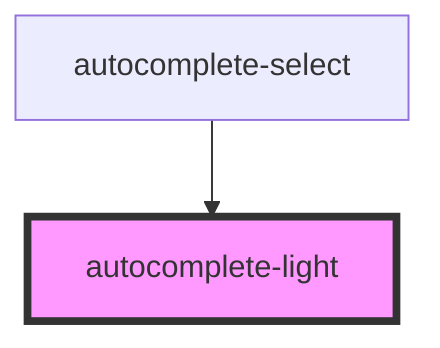

# autocomplete-light

<!-- Auto Generated Below -->

## Properties

| Property            | Attribute            | Description | Type      | Default          |
| ------------------- | -------------------- | ----------- | --------- | ---------------- |
| `boxContent`        | `box-content`        |             | `string`  | `undefined`      |
| `choiceSelector`    | `choice-selector`    |             | `string`  | `'[data-value]'` |
| `hide`              | `hide`               |             | `boolean` | `true`           |
| `minimumCharacters` | `minimum-characters` |             | `number`  | `1`              |
| `url`               | `url`                |             | `string`  | `undefined`      |
| `value`             | `value`              |             | `string`  | `''`             |

## Dependencies

### Used by

 - [autocomplete-select](../autocomplete-select)

### Graph

----------------------------------------------

*Built with [StencilJS](https://stenciljs.com/)*
